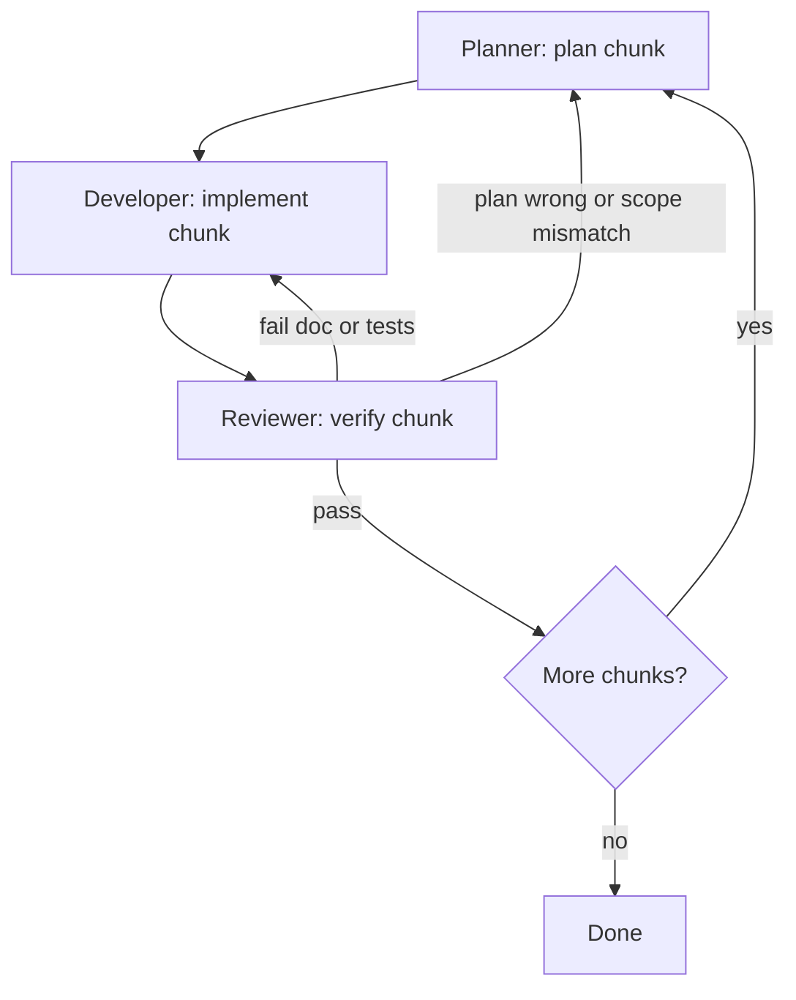

# Orchestration agent brief

## Mission

Run the **Planner → Developer → Reviewer** pipeline for each chunk of work. **Repeat** Developer → Reviewer (and if needed Planner) until quality gates pass or a **stop condition** is hit. Keep a visible **run log** (what passed, what failed, what changed).

## Role map

| Agent      | Brief |
|------------|--------|
| Planner    | [planner.md](planner.md) |
| Developer  | [developer.md](developer.md) |
| Reviewer   | [reviewer.md](reviewer.md) |

## Inputs

- User goal and scope (documentation-only vs includes automation).
- `wiki/assignment.md`, `wiki/requirements.md`, `wiki/task-context-for-automation.md`, `wiki/agent-workflow.md`.
- Target URL when relevant: `https://winwin.travel/app/landings/en` (assigner path; may 404). Working landing: `https://winwin.travel/landings/en/` per `wiki/task-context-for-automation.md`.

## Pipeline (per chunk)

1. **Planner** — Produce or refresh an **approved** plan: ordered chunks, files touched, risks, **acceptance criteria** per chunk.
2. **Developer** — Implement exactly the current chunk on `feature/<short-description>`; follow skills and `.cursor/rules/`.
3. **Reviewer** — Validate against that chunk’s acceptance criteria; run Playwright **only** if test/config code changed.

## Success and failure

- **Chunk success:** Reviewer reports **pass** against the chunk checklist (and tests green when automation is in scope).
- **Chunk failure:** Reviewer returns **actionable defects** (what failed, where, suggested fix). Do not advance to the next chunk until the current chunk passes.

## Retry loops (until working)

Use this routing:

- **Reviewer → Developer (default loop):** Most failures (broken links, wrong assertions, flaky locators, missing cases). Developer fixes; same chunk; Reviewer re-runs checks.
- **Reviewer → Planner:** Use when acceptance criteria were wrong, chunk too large, dependencies discovered, or scope must change. Planner emits a **revised** plan; then Developer continues.
- **Stop and escalate to the human:** Blocked after **3** full Reviewer→Developer cycles on the **same** chunk without progress; environment blocker (login, captcha, site down); or destructive/ambiguous instruction. Log attempts and blockers.

## Orchestrator responsibilities

- Track **current chunk**, **iteration count** for that chunk, and **mode** (doc-first vs automation).
- Ensure **user approval** of the Planner output before the first Developer pass on a new plan (when the user wants gating).
- After each Reviewer pass, append a one-line status: `PASS chunk=<id>` or `FAIL chunk=<id> reason=
 next=Developer|Planner`.

## Definition of done (full run)

- Every chunk shows **PASS** from Reviewer.
- If automation is in scope: `npx playwright test` is green for the agreed suite.
- Wiki and Cursor assets stay consistent with `wiki/requirements.md` and repo scope rules.
